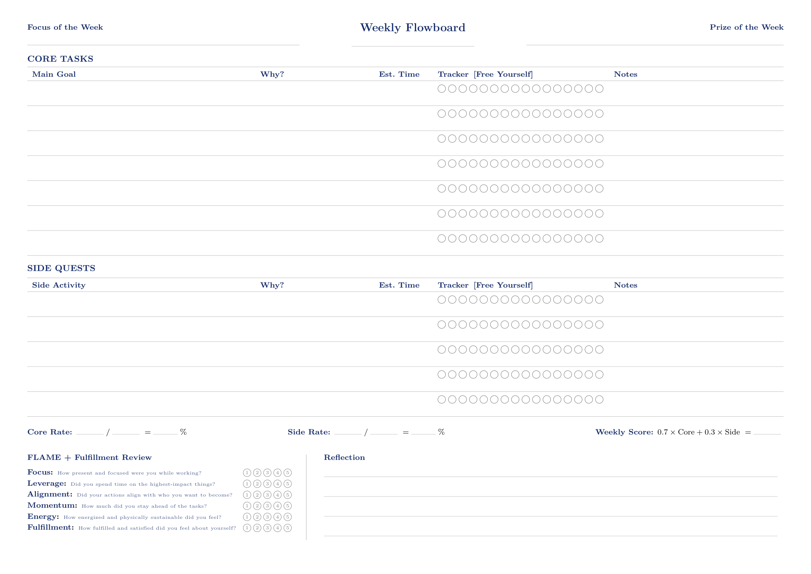

# Penpath

> Plan on paper. Track digitally.

Penpath is a hybrid productivity system that lets you write your weekly tasks by hand on a printable flowboard, then scan the paper to automatically sync everything into a digital planner — complete with progress tracking and statistics.

---

## The Problem

Most planners force you to choose: the focus of pen and paper, or the power of digital tracking. Penpath eliminates that tradeoff.

---

## How It Works

1. **Print** your weekly flowboard — a clean, A4 landscape layout designed for handwriting.
2. **Plan** your week on paper, the way humans think best.
3. **Scan** the completed sheet with the Penpath app.
4. **Track** your progress, completion rates, and productivity trends digitally — no manual re-entry.

---

## The Weekly Flowboard

The flowboard is a single A4 landscape page generated from a LaTeX template (`design/flowboard.tex`). It is designed to be printed, filled in by hand each week, and then scanned.



### Layout

**Header**
- Focus of the Week
- Date range
- Prize of the Week — a small reward you set for yourself upfront

**Core Tasks table**

The main table for your most important work that week. Each row is one goal with the following columns:

| Column | Purpose |
|---|---|
| Main Goal | The task or goal for the week |
| Why? | Your reason — keeps motivation visible |
| Est. Time | How long you expect it to take |
| Tracker [Free Yourself] | A row of circles to fill in as you make progress |
| Notes | Observations, blockers, or context |

**Side Quests table**

Same structure as Core Tasks, but for side activities and lower-priority work. The first column is labelled *Side Activity* instead of *Main Goal*.

**Rates**

At the bottom of the tables, three metrics are calculated by hand after the week:

- **Core Rate** — completed core circles / total core circles × 100
- **Side Rate** — completed side circles / total side circles × 100
- **Weekly Score** — `0.7 × Core + 0.3 × Side`

**FLAME + Fulfillment Review**

A 6-question self-rating section scored 1–5, completed at the end of the week:

| # | Dimension | Question |
|---|---|---|
| F | Focus | How present and focused were you while working? |
| L | Leverage | Did you spend time on the highest-impact things? |
| A | Alignment | Did your actions align with who you want to become? |
| M | Momentum | How much did you stay ahead and keep moving forward? |
| E | Energy | How energized and physically sustainable did you feel? |
| + | Fulfillment | How fulfilled and satisfied did you feel about yourself? |

**Reflection**

Free-form lines to write what happened, what to carry forward, and what to change next week.

---

## Tech Stack

| Layer | Technology |
|---|---|
| Frontend | Vue.js + Capacitor (PWA as starting point) |
| Backend | Django + Django REST Framework |
| OCR | Google Cloud Vision API |
| Async queue | Celery + Redis |
| Database | PostgreSQL |
| DevOps | Docker + Docker Compose |

---

## Architecture

```
┌─────────────┐    ┌─────────────┐    ┌─────────────┐    ┌─────────────┐
│  Print      │ -→ │  Scan       │ -→ │  Data       │ -→ │  Analytics  │
│  Layer      │    │  Layer      │    │  Layer      │    │  Layer      │
│  (PDF)      │    │  (OCR/ML)   │    │  (Storage)  │    │  (Dashboard)│
└─────────────┘    └─────────────┘    └─────────────┘    └─────────────┘
```

---

## Getting Started

```bash
cp .env.example .env
docker compose up -d
```

- Backend API: http://localhost:8000
- Frontend: http://localhost:5173

To generate the flowboard PDF, open `design/flowboard.tex` in [Overleaf](https://overleaf.com) and compile.

---

## Status

- [x] Project structure & Docker setup
- [x] Printable weekly flowboard (LaTeX)

---

## License

MIT
