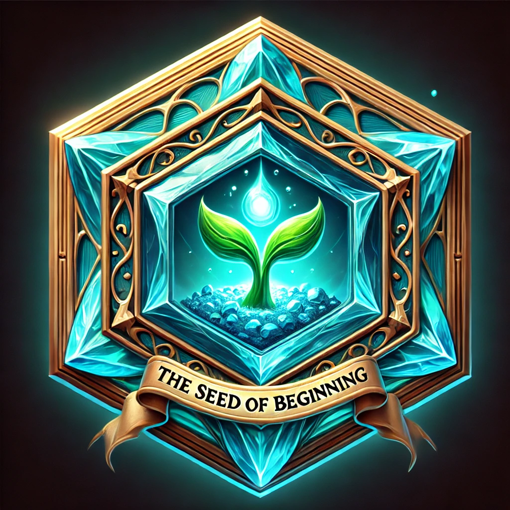
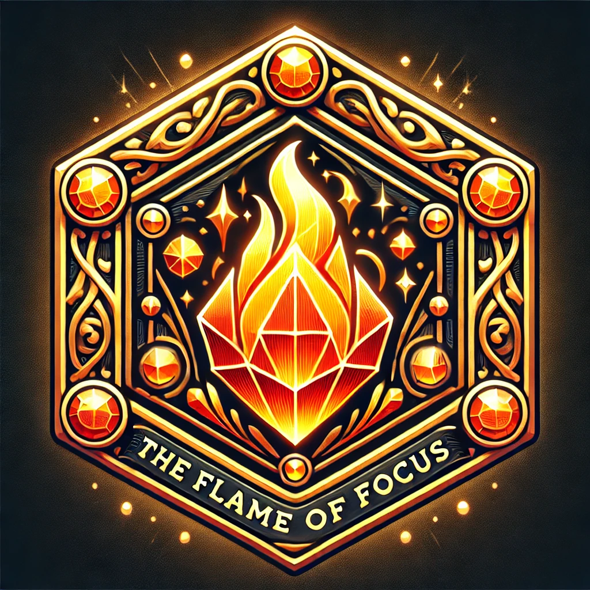
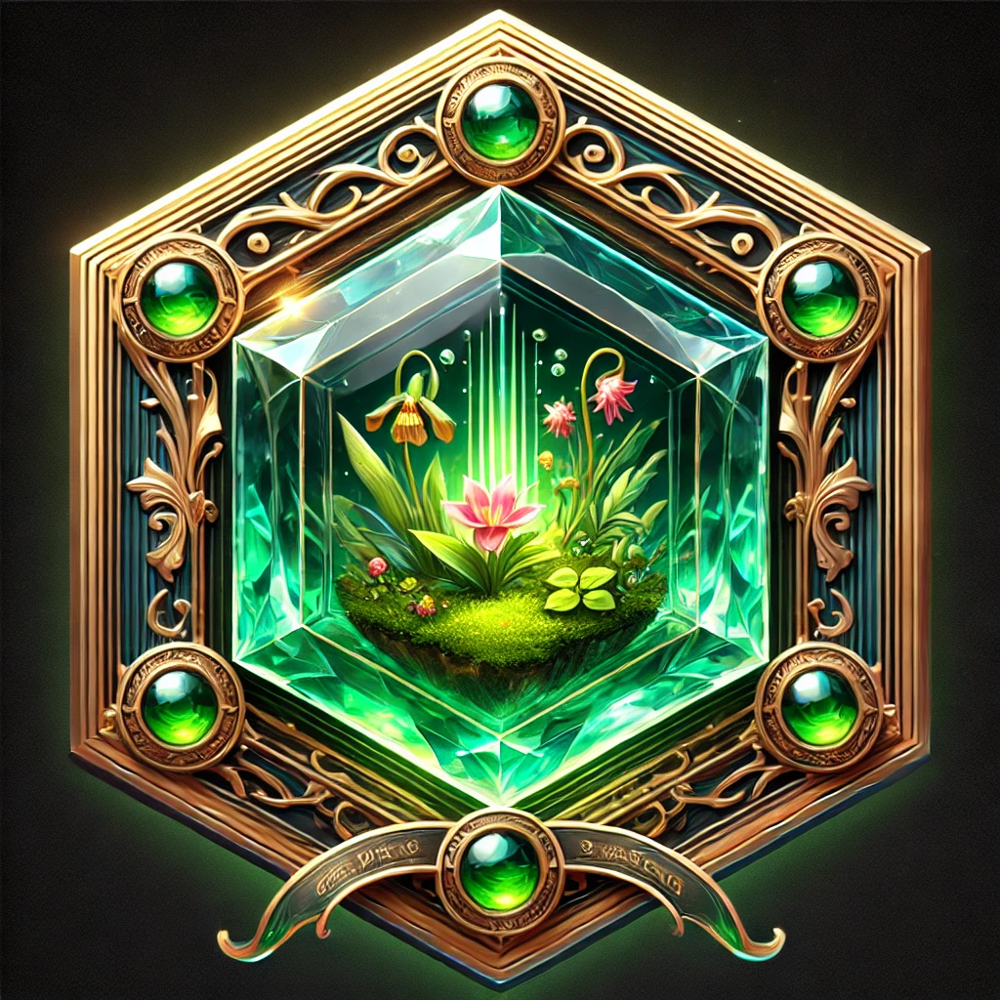
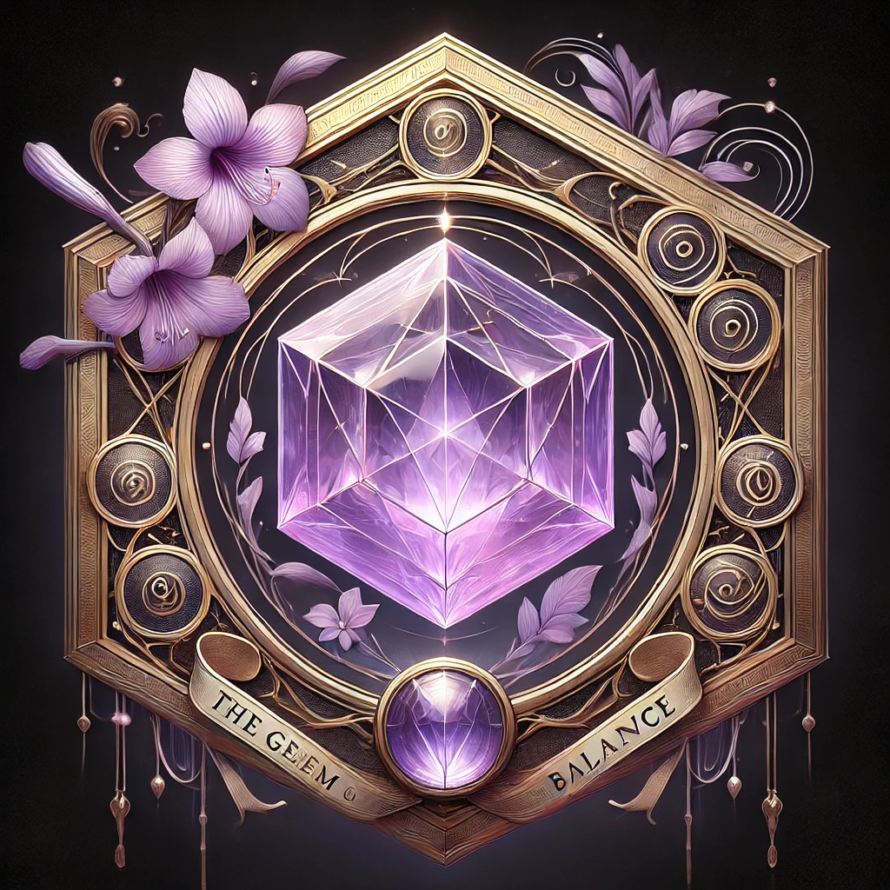
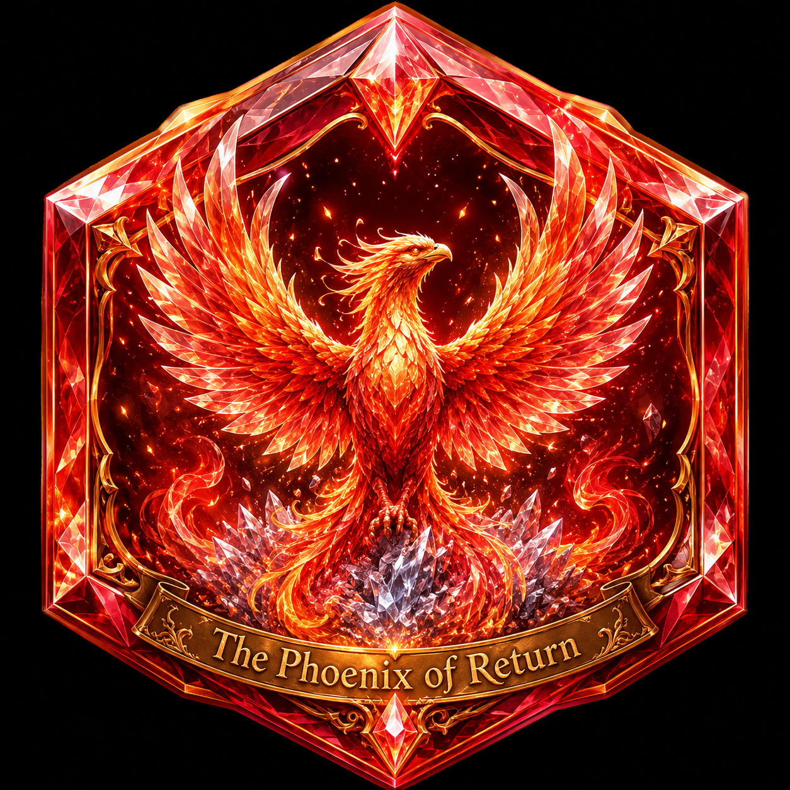

# Penpath

> Plan on paper. Track digitally.

Penpath is a hybrid productivity system that bridges analog and digital planning. You write your weekly tasks by hand on a printable flowboard, scan the paper with the app, and everything syncs automatically — complete with progress tracking, statistics, and a gamified badge system.

---

## The Problem

Most planners force a choice: the tactile focus of pen and paper, or the power of digital tracking. Penpath eliminates that tradeoff. Planning stays analog. Data and analytics live digitally.

---

## How It Works

1. **Print** your weekly flowboard — a clean A4 landscape layout designed for handwriting.
2. **Plan** your week on paper, the way humans think best.
3. **Scan** the completed sheet with the Penpath app.
4. **Track** completion rates, productivity trends, and earn progression badges — no manual re-entry.

---

## The Weekly Flowboard

The flowboard is a single A4 landscape page (`design/flowboard.tex`). Print it, fill it in by hand, scan it at the end of the week.


### Layout

**Header**
- Focus of the Week
- Date range
- Prize of the Week — a small reward you set for yourself upfront

**Core Tasks** — 7 rows

| Column | Purpose |
|---|---|
| Main Goal | The task or goal for the week |
| Why? | Your reason — keeps motivation visible |
| Est. Time | How long you expect it to take |
| Tracker [Free Yourself] | A row of circles to fill in as you make progress |
| Notes | Observations, blockers, or context |

**Side Quests** — 5 rows

Same structure as Core Tasks, for side activities and lower-priority work. First column is labelled *Side Activity*.

**Rates**

Three metrics calculated by hand at the end of the week:

- **Core Rate** — completed core circles / total core circles × 100
- **Side Rate** — completed side circles / total side circles × 100
- **Weekly Score** — `0.7 × Core Rate + 0.3 × Side Rate`

**FLAME + Fulfillment Review**

A 6-question self-rating section, each scored 1–5, completed at the end of the week:

| | Dimension | Question |
|---|---|---|
| F | Focus | How present and focused were you while working? |
| L | Leverage | Did you spend time on the highest-impact things? |
| A | Alignment | Did your actions align with who you want to become? |
| M | Momentum | How much did you stay ahead and keep moving forward? |
| E | Energy | How energized and physically sustainable did you feel? |
| + | Fulfillment | How fulfilled and satisfied did you feel about yourself? |

**Reflection**

Free-form lines to write what happened, what to carry forward, and what to change next week.

---

## Badge System

A gamified progression system built on three dimensions: **Momentum** (weekly streak), **Mastery** (monthly cycles), and **Resilience** (recovery after failure).

A week is a **win** when Weekly Score ≥ 80%. Only winning weeks advance the streak.

### Weekly Progression

Four consecutive wins unlock four crystal badges in order:

| Badge | Name | Color | Symbolism |
|:---:|---|---|---|
|  | **The Seed of Beginning** | Turquoise-blue | New beginnings, initiation of discipline |
|  | **The Flame of Focus** | Golden-orange | Growing intensity and momentum |
|  | **The Garden of Growth** | Emerald-green | Structured development, flourishing habits |
|  | **The Gem of Balance** | Lavender-purple | Harmony and sustainable discipline |

### Monthly Milestone

| Badge | Name | Awarded when |
|:---:|---|---|
|  | **The Crown of Consistency** | 4 consecutive winning weeks completed |

After earning the Crown the cycle restarts at a higher tier — Seed I → Crown I, then Seed II → Crown II, and so on — enabling infinite long-term progression.

### Recovery Badge

| Badge | Name | Awarded when |
|:---:|---|---|
|  | **The Phoenix of Return** | A failed week is immediately followed by a winning week |

The Phoenix is recorded permanently but does not restore the broken streak or count toward progression.

### Rules at a Glance

| Event | Effect |
|---|---|
| Weekly Score ≥ 80% | Win — advances streak (Week 1 → 2 → 3 → 4) |
| 4 consecutive wins | Crown awarded; cycle restarts at next tier |
| Weekly Score < 80% | Streak resets to zero; cycle restarts from Week 1 |
| Failure → Win | Phoenix of Return awarded; streak begins fresh from Week 1 |
| Any earned badge | Permanently unlocked — failures never remove past badges |

---

## Tech Stack

| Layer | Technology |
|---|---|
| Frontend | Vue.js + Capacitor (PWA as starting point) |
| Backend | Django + Django REST Framework |
| OCR | Google Cloud Vision API |
| Async queue | Celery + Redis |
| Database | PostgreSQL |
| DevOps | Docker + Docker Compose |

---

## Architecture

```
┌─────────────┐    ┌─────────────┐    ┌─────────────┐    ┌─────────────┐
│  Print      │ -→ │  Scan       │ -→ │  Data       │ -→ │  Analytics  │
│  Layer      │    │  Layer      │    │  Layer      │    │  Layer      │
│  (PDF)      │    │  (OCR/ML)   │    │  (Storage)  │    │  (Dashboard)│
└─────────────┘    └─────────────┘    └─────────────┘    └─────────────┘
```

---

## Getting Started

```bash
cp .env.example .env
docker compose up -d --build
docker compose exec backend python manage.py migrate
docker compose exec backend python manage.py seed_demo
```

| Service | URL |
|---------|-----|
| Frontend (Vue) | http://localhost:5173 |
| API | http://localhost:8000/api/v1/ |
| Admin | http://localhost:8000/admin/ |

**Demo login:** `demo` / `demo` (after `seed_demo`).

If login fails with a network or CSRF error, do **not** set `VITE_API_BASE_URL` to port 8000 unless you need to — the default Vite proxy (`/api/v1`) keeps cookies on one origin. Restart the frontend after changing env: `docker compose restart frontend`.

### Environment

See `.env.example`. Key variables: `DB_*`, `REDIS_URL`, `CORS_ALLOWED_ORIGINS`, `GOOGLE_APPLICATION_CREDENTIALS` (optional, for Vision OCR).

### API overview

| Method | Path | Description |
|--------|------|-------------|
| GET | `/api/v1/me/` | Current user |
| POST | `/api/v1/auth/login/` | Session login |
| GET/PATCH | `/api/v1/weeks/current/` | Current week flowboard |
| GET | `/api/v1/weeks/{start_date}/flowboard/` | Week detail |
| POST | `/api/v1/weeks/{start_date}/close/` | Close week + badges |
| GET | `/api/v1/dashboard/` | Dashboard stats |
| GET | `/api/v1/history/` | Week list |
| POST | `/api/v1/scans/` | Upload scan image |

Design tokens and UI map: `frontend/DESIGN.md`.

To generate the flowboard PDF, open `design/flowboard.tex` in [Overleaf](https://overleaf.com) or use `design/flowboard.pdf`.

---

## Status

- [x] Project structure & Docker setup
- [x] Printable weekly flowboard (LaTeX)
- [x] Badge system design (Momentum · Mastery · Resilience)
- [x] Vue 3 app with light + dark themes
- [x] Django models, REST API, badge services
- [x] Scan upload + Celery OCR stub
- [ ] Google Cloud Vision layout parsing (production OCR)

---

## License

MIT
